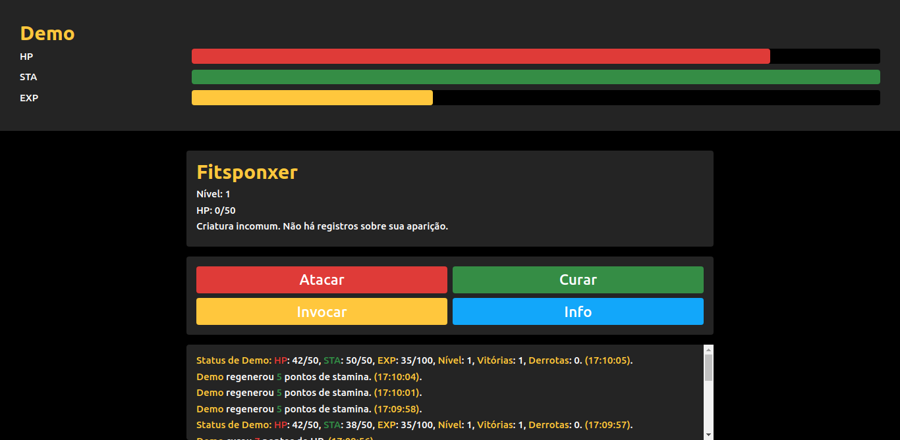

# RPG Proto

---

## :bookmark_tabs: Tabela de Conteúdo

- [:closed_book: Sobre](#closed_book-sobre)
- [:hammer_and_pick: Tecnologias Utilizadas](#hammer_and_pick-tecnologias-utilizadas)
- [:sparkles: Features](#sparkles-features)
- [:handshake: Seja um Contribuidor](#handshake-seja-um-contribuidor)

---

## :closed_book: Sobre

RPG Proto é um simples protótipo de RPG, que inclui as funcionalidades básicas
de um, como atacar e curar.

---

## :hammer_and_pick: Tecnologias Utilizadas

Para desenvolver esta aplicação, utilizei as seguintes tecnologias:

- HTML5
- CSS3
- Javascript (Vanilla)

---

## :sparkles: Features

- Criação e gerenciamento de personagem
- Simulação de ambiente de batalha

---

## :handshake: Seja um contribuidor

Tem alguma ideia que poderia alavancar ainda mais o projeto, e deseja implementar? É simples!

1. Faça fork do proketo
2. Modifique o que achar necessário
3. Faça o commit das mudanças
4. Crie um Pull Request